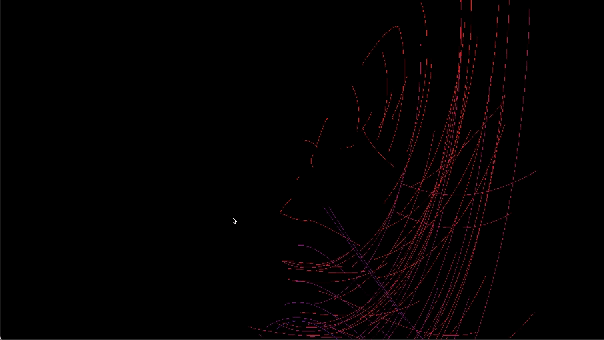

# Lorentz Attractor Simulation with SFML

The saying 'A butterfly flapping its wings in the Amazon can cause rain in the Sahara' eloquently encapsulates the Butterfly Effect, a captivating concept within Chaos Theory. This project serves as a simulation of the renowned Lorenz Attractor, a peculiar strange attractor, and delves into another intriguing experiment—the double pendulum. Leveraging the SFML library, it meticulously visualizes the trajectories of numerous particles and pendulum bobs within a 2D space. By doing so, it brings to life the idea that seemingly minor actions can unfold into significant and unpredictable outcomes.

## Table of Contents

- [Introduction](#introduction)
- [Prerequisites](#prerequisites)
- [Installation](#installation)
- [Lorentz Attractor](#lorentz)
- [Double Pendulum](#)
- [License](#license)

## Introduction

The Lorenz Attractor, an intriguing set of chaotic solutions derived from a system of differential equations, unveils the extraordinary sensitivity of these equations to even the slightest changes in input—yielding vastly divergent outputs. In tandem with this chaotic phenomenon, the project extends its simulation prowess to include the enigmatic double pendulum experiment. This captivating exploration delves into the complex dynamics of interconnected pendulum bobs, revealing mesmerizing patterns of motion. Powered by the SFML library, the project brings these chaotic phenomena to life by visualizing the intricate trajectories of particles and the mesmerizing dance of the double pendulum within a dynamic 2D space.

## Lorentz Attractor

This program implements a simulation of the Lorenz Attractor, a system of differential equations that demonstrates chaotic behavior. The Lorenz Attractor is defined by three coupled ordinary differential equations, commonly known as the Lorenz equations:

1. **dx/dt = σ * (y - x)**
2. **dy/dt = x * (ρ - z) - y**
3. **dz/dt = x * y - β * z**

where:
- **x, y, z** are the state variables representing the system's position in three-dimensional space.
- **σ, ρ, β** are parameters that govern the behavior of the system.

### Key Equations

The Lorenz Attractor describes the evolution of a dynamic system over time. The variables **x, y, z** represent the system's position in three-dimensional space, and their evolution is determined by the following equations:

1. **dx/dt = σ * (y - x)**
   - Describes the rate of change of x. It is proportional to the difference between y and x, scaled by the parameter σ.

2. **dy/dt = x * (ρ - z) - y**
   - Describes the rate of change of y. It involves the product of x and the difference between ρ and z, minus y.

3. **dz/dt = x * y - β * z**
   - Describes the rate of change of z. It involves the product of x and y, scaled by β, minus z.

### Simulation Details

This program uses SFML to visualize the simulation. It generates a specified number of particles, each following the Lorenz equations. The initial positions of the particles are randomized, and a random factor is introduced to the parameters σ, ρ, and β for each particle. The result is a dynamic and visually interesting simulation of chaotic motion.

### Parameters

- **Randomized Initial Positions**: Each particle starts with a random initial position.
- **Chaotic Paths**: The Lorenz equations are used to simulate chaotic motion, resulting in intricate and unpredictable paths.
- **Variable Parameters**: Random factors are introduced to the parameters of the Lorenz equations for each particle, adding variability to the simulation.

### Visual


## Double Pendulum
A double pendulum consists of two point masses connected by massless rigid rods. The motion of such a system can be described using a set of coupled second-order ordinary differential equations.

### Equations of Motion
The angular positions of the two pendulums are denoted by θ₁ and θ₂, while their angular velocities are ω₁ and ω₂, respectively. The lengths of the pendulum arms are represented by l₁ and l₂, and the masses of the bobs are m₁ and m₂.

The equations are given by:

1. For the first pendulum:
   $$ \dot{\omega}_1 = -\frac{g \cdot (2 \cdot m_1 + m_2) \cdot \sin(\theta_1) + m_2 \cdot g \cdot \sin(\theta_1 - 2 \cdot \theta_2) - 2 \cdot \sin(\theta_1 - \theta_2) \cdot m_2 \cdot \left( \omega_2^2 \cdot l_2 + \omega_1^2 \cdot l_1 \cdot \cos(\theta_1 - \theta_2) \right)}{l_1 \cdot (2 \cdot m_1 + m_2 - m_2 \cdot \cos(2 \cdot (\theta_1 - \theta_2)))} $$

   $$\dot{\theta}_1 = \omega_1$$
   

2. For the second pendulum:
   $$ \dot{\omega}_2 = \frac{2 \cdot \sin(\theta_1 - \theta_2) \cdot \left( \omega_1^2 \cdot l_1 \cdot (m_1 + m_2) + g \cdot (m_1 + m_2) \cdot \cos(\theta_1) + \omega_2^2 \cdot l_2 \cdot m_2 \cdot \cos(\theta_1 - \theta_2) \right)}{l_2 \cdot (2 \cdot m_1 + m_2 - m_2 \cdot \cos(2 \cdot (\theta_1 - \theta_2)))} $$

   $$ \dot{\theta}_2 = \omega_2 $$

These ODE's can easily be solved using the Runge-Kutta method

### Visual


## Prerequisites

Before running the project, make sure you have the following installed:

- SFML: Simple and Fast Multimedia Library
- C++ Compiler (e.g., g++)
## Installation

1. **Install SFML:**

   Follow the instructions on the [SFML website](https://www.sfml-dev.org/download.php) to download and install SFML on your system.

2. **Clone the Repository:**

   ```bash
   git clone https://github.com/your-username/lorentz-attractor-sfml.git

Build the Project:

Navigate to the project directory and build the executable:

bash
Copy code
g++ -std=c++11 -o main main.cpp -lsfml-graphics -lsfml-window -lsfml-system
Usage
Run the executable to start the simulation:

bash
Copy code
./main
The application window will appear, displaying the trajectories of multiple particles moving according to the Lorenz Attractor equations.

Customization
Feel free to customize the simulation by adjusting parameters such as the number of particles, initial positions, and simulation constants in the code.

License
This project is licensed under the MIT License.